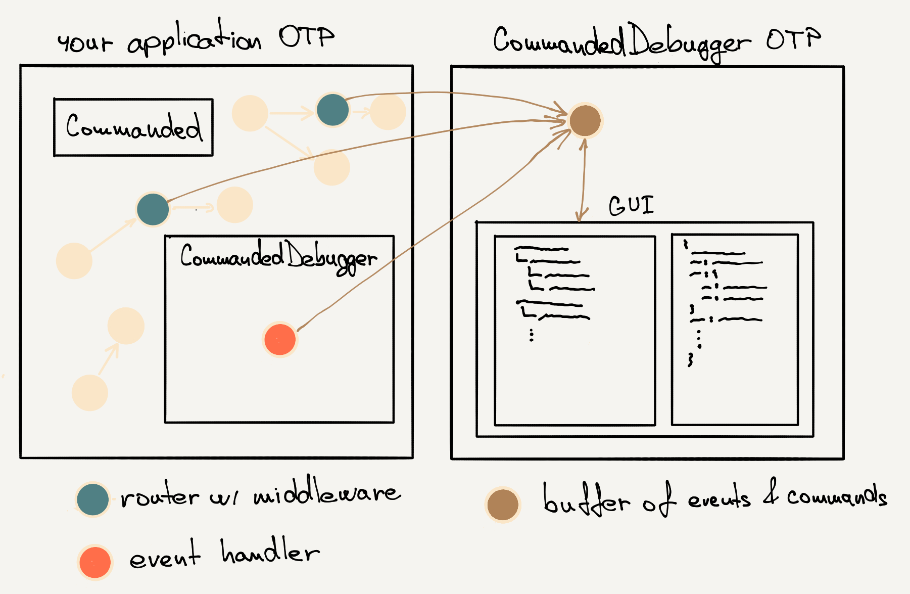

# CommandedDebugger

Tool for debugging events/commands from your applications.

### Why
The [commanded_events_map](https://github.com/zdenal/commanded_events_map) is tool by which we can see how the commands & events
are composed in our app. But we don't see the flows between them as we miss correlations/causations which are available only
in runtime. This app is allowing that


### Notice
This application is still under developing. It is not perfect there are still stuff to improve it and make it better (see [TODO section](#todo)).
Feel free to contribute.

### Example
This example is made with https://github.com/slashdotdash/conduit. The commands/events are grouped in tree by `correlation_id`.


## Installation

### 1) Prepare your app
- add `commanded_debugger` to your list of dependencies in `mix.exs`:

```elixir
def deps do
  [
    {:commanded_debugger, github: "zdenal/commanded_events_map"}
  ]
end
```

This will be soon moved to hex packages when some details will be solved ..

- add `:commanded_application` to `extra_applications`
```elixir
def application do
  [
    extra_applications: [:logger, :commanded_debugger],
    mod: {YourApp.Application, []}
  ]
end
```

- add to your routers middleware `middleware(CommandedDebugger.Middleware)` which is sending commands to CommandedDebugger buffer
- add `CommandedDebugger.EventHandler` into some supervisor to make sure it is started (subsribing to `$all` by default).It will send each event into buffer running on UI application.

Example from Conduit test:
```elixir
Supervisor.init(
  [
    Blog.Projectors.Article,
    Blog.Projectors.Tag,
    Blog.Workflows.CreateAuthorFromUser,
    CommandedDebugger.EventHandler
  ],
  strategy: :one_for_one
)
```


This middleware is logic inspired by [commanded-audit-middleware](https://github.com/commanded/commanded-audit-middleware)

- run your application with `--sname` to run node with correctly set host: `iex --sname app -S mix phx.server`

For first time please wait for while to get CommandedDebugger event handler up to date. If you would have
runned CommandedDebugger app in another terminal the app could get stuck w/ a huge amount of events (depends how many
events you already have in DB).

### 2) Run CommandedDebugger UI
- clone CommandedDebugger somewhere to your disk `git clone git@github.com:zdenal/commanded_debugger.git`
- go to the repository and run `./bin/start`

The debugger is getting events/commands from your app and you can use your app and see the commands/events flows grouped
by correlations and linked by causations.


## How it works
Starting properly your app with `--sname` will allow to comunnicate with CommandedDebugger UI (runned by `./bin/start` from CommandedDebugger repository). The `:commanded_debugger` within
your `extra_applications` will connect nodes (app & debugger ui). The same with middlewares, they will make
sure the commands from routers will be sent into buffer also.

#### Picture



# TODO
- [ ] better tree manipulating. Also after getting new events/command the navigating is not working correctly for while as tree was changed.
- [ ] better handling new tree structure when new events/commands are comming to not changing so much
- [ ] better displaying of event/command detail (split it to meaningfull sections)
- [ ] find way how to used this w/ tests (integration test, ...)

# Questions / Issues
I was trying to start event handler automatically by application inside debugged project/application [here](lib/commanded_debugger/application.ex) 17th line, but in some apps getting error
on start
```
** (Mix) Could not start application commanded_debugger: CommandedDebugger.Application.start(:normal, []) returned an error: shutdown: failed to start child: {CommandedDebugger.EventHandler, "commanded_debugger_event_handler"}
    ** (EXIT) an exception was raised:
        ** (ArgumentError) unknown registry: Commanded.Registration.LocalRegistry
            (elixir) lib/registry.ex:1154: Registry.key_info!/1
            (elixir) lib/registry.ex:213: Registry.whereis_name/2
            (stdlib) gen.erl:76: :gen.start/6

```
It is caused, because the `:commanded_debugger` is started before application itself (by `extra_applications: [.., :commanded_debugger]`. Maybe there is some way how to solve this and
avoid the need add CommandedDebugger event handler manually into some supervisor in debugged application. If you know please help.
